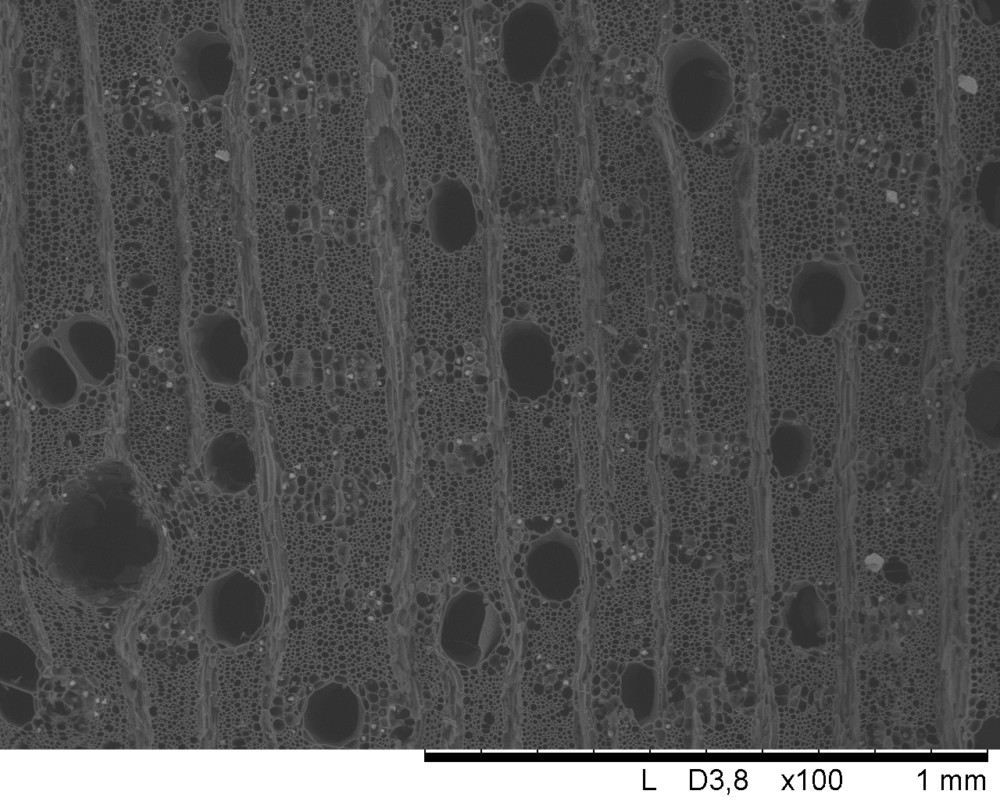
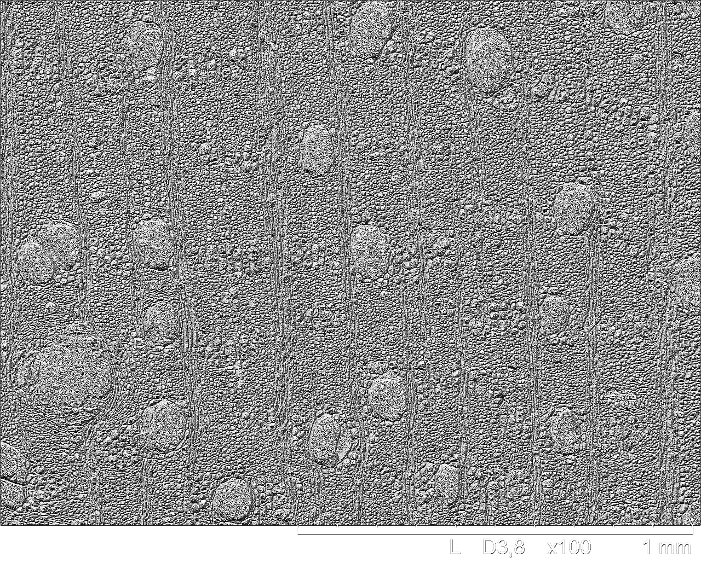

# Projeto LBP (Local Binary Patterns)

Este repositório contém o código-fonte e os arquivos relacionados ao cálculo de padrões binários locais (LBP) em imagens. Este projeto foi desenvolvido para a disciplina de **Programação II (CI-1002)**, abordando a estratégia de comparação de imagens baseada no descritor LBP.

## Funcionalidades

### 1. Comparação de Imagens
Comparar uma imagem de teste com todas as imagens de uma base de referência utilizando histogramas LBP e calcular a distância Euclidiana para determinar a imagem mais similar.

**Exemplo de uso:**
```bash
./lbp -d ./base -i img1.tif
```
Saída esperada:
```
Imagem mais similar: <nome_da_imagem> <distância>
```

### 2. Geração de Imagem LBP
Processar uma imagem de entrada e gerar a versão transformada com LBP.

**Exemplo de uso:**
```bash
./lbp -i img1.tif -o img_out.tif
```


## Estrutura do Repositório

  - `lbp.c`: Implementação do cálculo de LBP e histograma.
  - `pgm.c`: Manipulação de arquivos PGM.
  - `main.c`: Estrutura geral do código para funcionamento.

- **`imagensTeste/`**: Contém imagens de teste para testes( todas em .pgm, recomendado criar outra pasta e retirar uma das imagens para testes)

- **`Makefile`**: Compilar o programa.

- **`relátorio.pdf`**: Relátotio em PDF que explica o funcionamento do trabalho em partes.


## Como Compilar

Certifique-se de ter o compilador GCC instalado. Utilize o seguinte comando para compilar o programa:
```bash
make
```
Isso gerará um executável chamado `LBP` na raiz do projeto.

## Como Executar

### 1. Comparação de Imagens

**Comando:**
```bash
./LBP -d <diretório_base> -i <imagem_teste>
```

- `<diretório_base>`: Caminho para o diretório contendo imagens de referência.
- `<imagem_teste>`: Caminho para a imagem que será comparada.

**Exemplo:**
```bash
./LBP -d ./base -i ./data/img_test.pgm
```

**Saída esperada:**
```
Imagem mais similar: img_referencia.pgm 0.123456
```

### 2. Geração de Imagem LBP

**Comando:**
```bash
./LBP -i <imagem_entrada> -o <imagem_saida>
```

- `<imagem_entrada>`: Caminho para a imagem original.
- `<imagem_saida>`: Caminho para salvar a imagem processada.

**Exemplo:**
```bash
./LBP -i ./data/img_input.pgm -o ./data/img_output.pgm
```

## Testes

### Imagem de Entrada e Resultados
Incluímos duas imagens de teste, que mostram a aplicação do LBP:

#### Imagem Original


#### Imagem Processada


